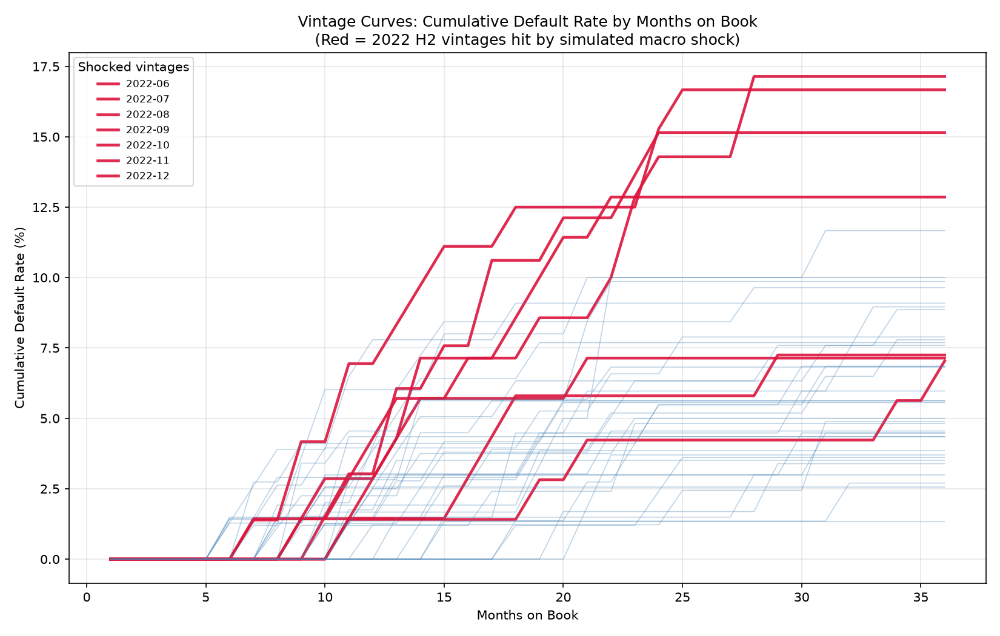

# SQL Skill-Building Project: Consumer Loan Risk Analytics

A progressive set of SQL exercises on a synthetic consumer-lending
dataset, demonstrating fluency from basic aggregation through
window functions, multi-table joins, and vintage curve analysis --
the kind of queries a credit risk analyst runs day to day.

## Stack

- **Database:** DuckDB (embedded, zero-setup, full window function support)
- **Data generation:** Python (pandas, numpy)
- **Schema:** `borrowers`, `loans`, `payments`, `delinquency_history`

## Why synthetic data, and how it was built

Real consumer credit datasets (e.g. Lending Club) exist but don't
have the exact schema shape needed for this exercise (monthly
payment-level granularity, a separate delinquency snapshot table).
Instead, `generate_data.py` builds 2,000 borrowers and 3,000 loans
with **deliberately correlated risk logic**:

- Lower FICO scores -> higher lifetime default probability
- Loans originated between **2022-06 and 2022-12** carry a simulated
  macro shock (1.8x higher default hazard) -- standing in for a
  real-world event like a rate-hike-driven underwriting miss
- Defaults, when they happen, cluster in months 8-14 of a loan's
  life (a rough triangular distribution), then roll through
  `Current -> 30 DPD -> 60 DPD -> Charged Off` over 3 months

This gives every query below something real to detect, instead of
flat noise.

## Reproducing this project

```bash
pip3 install duckdb pandas numpy
python3 generate_data.py          # builds the 4 CSVs
python3 load_to_duckdb.py         # loads CSVs into risk.duckdb
```

Then run any query in `queries/` against `risk.duckdb` with your
DuckDB client of choice, or via Python:

```python
import duckdb
con = duckdb.connect("risk.duckdb")
con.execute(open("queries/01_origination_volume.sql").read()).df()
```

## Queries & Findings

| # | File | What it answers | Key finding |
|---|---|---|---|
| 1 | `01_origination_volume.sql` | Monthly loan volume & avg FICO | Volume steady at ~$1-1.9M/month; avg FICO consistently 670-693 across cohorts |
| 2 | `02_default_rate_by_cohort.sql` | Raw default rate per vintage | Noisy month-to-month (small cohort sizes, ~50-90 loans/month); recent vintages look artificially low since they haven't seasoned |
| 3 | `03_rolling_3mo_bad_rate.sql` | Smoothed 3-month rolling bad rate | Clearly elevated rolling average (10-14%) across Jul-Dec 2022 vs ~5-7% baseline -- the simulated shock is visible once smoothed |
| 4 | `04_mob_and_delinquency_status.sql` | Delinquency status as of each payment | Confirms the designed lifecycle: `Current` for 6 months, then `30 DPD -> 60 DPD -> Charged Off` in the final 3 months for a defaulted loan |
| 5 | `05_vintage_curves.sql` | Cumulative default by months-on-book, per vintage | **The key result:** at MOB 24, the 2022-07 vintage shows 15.15% cumulative default vs 5.63% for 2021-07 at the *same age* -- an age-controlled comparison that confirms the shock is real, not just an artifact of longer observation |
| 6 | `06_risk_deciles.sql` | FICO-based risk decile segmentation | Default rate falls from 16.27% (decile 1, worst FICO) to ~3-4% (deciles 8-10, best FICO) -- confirms FICO is meaningfully predictive in this data |

Sample outputs for each query are in `sample_outputs/`.


## Visual: Vintage Curves



Each line traces one origination vintage's cumulative default rate as
it ages (months on book). Red lines are the vintages hit by the
simulated macro shock (loans originated 2022-06 through 2022-12) --
they sit clearly above the blue baseline vintages at every age,
confirming the effect is real and not just a byproduct of some
vintages being observed longer than others.

## Data validation performed

Before trusting any query result, two checks were run:

1. **Reconciliation between `payments` and `delinquency_history`:**
   these are two independently-populated tables (mirroring a
   transactional table vs. a precomputed warehouse snapshot in a
   real system). A join comparing computed months-on-book against
   the stored value found **0 mismatches** across ~113K rows.
2. **Distribution sanity check on `days_past_due`:** confirmed
   113,041 clean payments plus exactly 214 rows each at 30/60/120
   DPD -- matching the 214 charged-off loans 1:1, as expected from
   the generator's design (each defaulted loan passes through
   exactly one 30-day and one 60-day month before charge-off).

## Known issues hit & fixed during development

- **First data generator used a random-walk delinquency model**
  (each month, a coin flip on whether DPD increases or resets).
  This required 4 consecutive unlucky months to reach charge-off,
  which is statistically almost impossible at realistic monthly
  hazard rates -- resulted in 0% defaults across the entire dataset.
  Fixed by switching to a direct approach: decide *whether* a loan
  defaults first (based on FICO + vintage shock), then simulate
  *when*.
- **Second bug:** mixing `None` and integers in a pandas column
  silently upcasts to float and converts `None` to `NaN`, so
  `default_mob is None` checks silently failed for every row
  (`NaN is None` is `False`). Every loan was incorrectly treated as
  defaulting. Fixed by using `pd.isna()` / `pd.notna()` instead of
  `is None` / `is not None`.

## Schema

**borrowers**
| column | type | notes |
|---|---|---|
| borrower_id | INTEGER (PK) | |
| fico_score | INTEGER | 300-850, snapshot at origination |
| annual_income | DECIMAL | |
| state | VARCHAR | 2-letter US state code |
| dti_ratio | DECIMAL | debt-to-income %, at origination |

**loans**
| column | type | notes |
|---|---|---|
| loan_id | INTEGER (PK) | |
| borrower_id | INTEGER (FK) | references borrowers |
| origination_date | DATE | drives vintage month |
| loan_amount | DECIMAL | |
| term_months | INTEGER | 36 or 60 |
| interest_rate | DECIMAL | |
| loan_status | VARCHAR | Current / Fully Paid / Charged Off |

**payments**
| column | type | notes |
|---|---|---|
| payment_id | INTEGER (PK) | |
| loan_id | INTEGER (FK) | references loans |
| payment_date | DATE | monthly cadence |
| scheduled_amount | DECIMAL | |
| amount_paid | DECIMAL | |
| days_past_due | INTEGER | 0, 30, 60, or 120 |

**delinquency_history**
| column | type | notes |
|---|---|---|
| snapshot_id | INTEGER (PK) | |
| loan_id | INTEGER (FK) | references loans |
| snapshot_date | DATE | monthly snapshot |
| months_on_book | INTEGER | |
| delinquency_bucket | VARCHAR | Current / 30DPD / 60DPD / 90+DPD / Charged Off |

See `RISK_MEMO.md` for a narrative write-up of findings.
